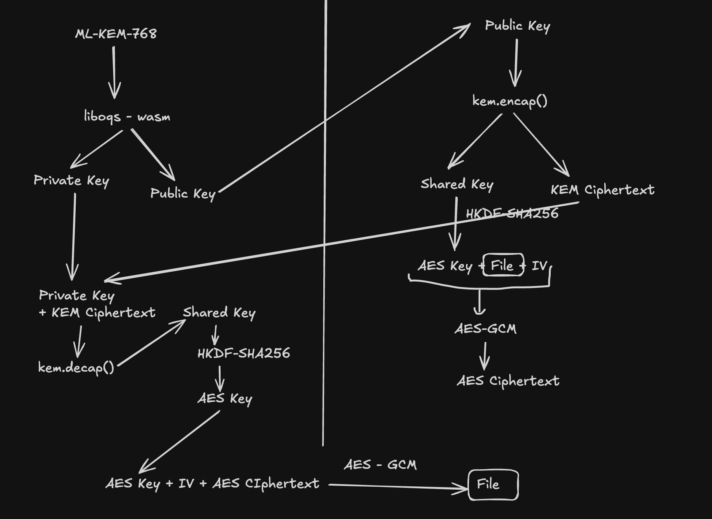

# CS_Lab_1 — Classmate Hub (Post-Quantum Edition)

A secure class portal enabling students to log in, encrypt documents utilizing **Post-Quantum ML-KEM-768** keys (powered by **liboqs**), and decrypt them with their private key — with all processing handled entirely locally in the browser.

## System Architecture

The application is built on a Flask (Python) backend, supported by a SQLite database, and relies on browser-side Post-Quantum Cryptography (PQC) to handle file encryption and decryption.



---

## Detailed Workflow (Post-Quantum)

We have upgraded from traditional RSA-OAEP-2048 to the NIST FIPS 203 Key Encapsulation Mechanism **ML-KEM-768** (formerly known as Kyber768, NIST security level 3) using **liboqs**. The underlying AES-256-GCM file encryption layer remains identical, and the client-side security model for private keys is preserved (keys never exit the browser environment).

### 1. 🔐 Key Generation (ML-KEM-768 via liboqs)

- The user's browser generates an **ML-KEM-768 keypair** straight into memory leveraging **liboqs-wasm / oqs.js** (WebAssembly), complete with a bundled pure-JS FIPS 203 fallback (`public/ml-kem.js`, fully compatible with liboqs).
- Parameter Sizes (FIPS 203): Public key is **1184 bytes**, Secret key is **2400 bytes**, Ciphertext is **1088 bytes**, and the Shared secret is **32 bytes**.
- The generated **public key** can be exported in PEM format (`-----BEGIN ML-KEM-768 PUBLIC KEY-----`) and downloaded as `public_key.pqc` (or `.pem`).
- The **private (secret) key** is also exported as a PEM file (`-----BEGIN ML-KEM-768 PRIVATE KEY-----`) and downloaded as `private_key.pqc`.
- Crucially, the server **never has access to the private key**.

> **Fallback Mode:** If the application is accessed over standard HTTP on a non-localhost network (like a LAN IP), `crypto.subtle` APIs are disabled by the browser. When this happens, the client sends a `POST /generate-keys` request to the Flask server, which will then generate the keypair using **liboqs-python** (`oqs.KeyEncapsulation("ML-KEM-768")`, or its alias `"Kyber768"`).

---

### 2. 🔒 File Encryption (Hybrid ML-KEM-768 + AES-256-GCM)

The legacy Public Key Encryption method (encrypting an AES key using RSA) is swapped out for a **KEM process**:

```text
User selects a file and provides their ML-KEM-768 public key
        ↓
Step 1: KEM encapsulation happens using the recipient's public key → (kem_ciphertext[1088 B], shared_secret[32 B])
Step 2: A 256-bit AES key is derived = HKDF-SHA256(shared_secret, salt="", info="ClassmateHub-ML-KEM-768-AES-256-GCM-v1")
        (Using the 32-byte secret directly is also compliant; however, HKDF provides domain separation)
Step 3: The file data is encrypted using AES-256-GCM + a 12-byte random IV → resulting in the ciphertext (ct || 16-B tag)
        ↓
The browser POSTs { ciphertext, iv, encrypted_key (= base64 kem_ciphertext), filename } to /set-message
        ↓
The Flask server saves all 4 pieces of data in the SQLite database linked to the user account
```

> Why combine two layers? The KEM is responsible for transporting a fresh shared secret securely, without relying on RSA. Meanwhile, AES-GCM handles the actual file encryption. This strategy represents the PQC hybrid model (KEM + DEM), which is the recommended approach for post-quantum transitions.

---

### 3. 🔓 File Decryption (Client-side, Private Key remains local)

```text
User provides their ML-KEM-768 private_key.pqc on the account dashboard
        ↓
Step 1: shared_secret = KEM decapsulation(private key, kem_ciphertext)
Step 2: aes_key = HKDF-SHA256(shared_secret); The ciphertext is then decrypted via AES-GCM + IV → yielding the file bytes
        ↓
Text files  → Content is rendered directly on the screen
Other files → Available for download via the "Download Decrypted File" button
        ↓
The private key is NEVER transmitted to the backend server
```

---

### 4. 🏗️ Component Architecture

```text
Browser (Frontend)                 Server (Flask/Python + liboqs)     Database (SQLite)
─────────────────────              ──────────────────────────         ─────────────────
public/ml-kem.js                   app.py                             classmates.db
public/crypto.js                     │                                  │
  │ (liboqs-wasm / ML-KEM-768 KEM,   │                                  │
  │  HKDF-SHA256, AES-256-GCM)       │                                  │
  ├─ generateKeyPair()        ←──── /generate-keys (liboqs fallback)  │
  ├─ encryptFile()  (encap)   ←──── /encrypt-file  (liboqs fallback)  │
  ├─ decryptFile()  (decap)   ←──── /decrypt-file  (liboqs fallback)  │
  │                                  │                                  │
  │                           POST /set-message ──────────────→  { ciphertext,
  │                           GET  /account    ←──────────────      iv,
  │                                                                  encrypted_key
  │                                                                  (= kem_ct),
  │                                                                  filename }
```

---

## Core Features

- Authenticate with a unique username and password combination.
- Access a personalized account dashboard.
- **Generate** quantum-resistant ML-KEM-768 keypairs (public and private keys) using liboqs.
- **Download** both cryptographic keys as `.pqc` files (compatible with `.pem`).
- **Encrypt** files with a KEM public key, which are then securely stored in the database.
- **Decrypt** files leveraging the private key entirely within the browser via decapsulation.
- Download the resulting decrypted files to your machine.
- Update your account password at any time.

---

## Cryptographic Setup

| Layer | Algorithm | Purpose |
|-------|-----------|---------|
| Key Encapsulation (PQC) | ML-KEM-768 (FIPS 203, previously Kyber768) powered by liboqs | Generates kem_ciphertext alongside a 32-byte shared secret |
| Key Derivation | HKDF-SHA256 (info `ClassmateHub-ML-KEM-768-AES-256-GCM-v1`) | Extracts a 256-bit AES key from the shared secret |
| Symmetric Encryption | AES-256-GCM (12-byte IV, 16-byte tag)    | Encrypts the raw file data |

This structure defines a **PQC hybrid (KEM + DEM)** methodology, representing the NIST-approved post-quantum successor to classical RSA-based hybrid encryption.

FIPS 203 sizes breakdown: `pk=1184 B`, `sk=2400 B`, `ct=1088 B`, `ss=32 B`.

---

## Technologies Used

- [Python](https://python.org/) utilizing the [Flask](https://flask.palletsprojects.com/) framework
- [SQLite](https://sqlite.org/) for persistent data storage (via Python `sqlite3`)
- Vanilla HTML/CSS, without relying on frontend frameworks
- **liboqs** ([Open Quantum Safe](https://openquantumsafe.org/)):
  - Frontend: `liboqs-wasm` / `oqs.js` WebAssembly build, featuring a bundled
    `public/ml-kem.js` FIPS 203 fallback (using the KAT-verified `mlkem` npm module)
  - Backend: `liboqs-python` (`oqs.KeyEncapsulation("ML-KEM-768")`, fallback `"Kyber768"`)
- **Web Crypto API** (`crypto.subtle`) for browser-side HKDF-SHA256 + AES-256-GCM operations
- Python [`cryptography`](https://cryptography.io/) (`AESGCM`) for server-side AES-256-GCM execution

---

## Installation & Setup

1. Initialize and activate a Python virtual environment:

   ```bash
   python3 -m venv venv
   source venv/bin/activate
   ```

2. Install the necessary Python packages (requires a system-level `liboqs` installation; details below):

   ```bash
   pip install -r requirements.txt
   # Installs Flask, liboqs-python, and cryptography
   ```

   Installing System liboqs (Example for Ubuntu/Debian):

   ```bash
   # Compiling liboqs 0.16.0 to /usr/local for this environment
   cmake -S /path/to/liboqs -B /tmp/liboqs-build -DCMAKE_INSTALL_PREFIX=/usr/local
   cmake --build /tmp/liboqs-build -j && sudo cmake --install /tmp/liboqs-build
   sudo ldconfig
   ```

3. (Optional step for rebuilding the browser bundle) The provided `public/ml-kem.js` file is a pre-compiled IIFE bundle derived from the [`mlkem`](https://www.npmjs.com/package/mlkem) FIPS 203 package (which is compatible with liboqs). You can rebuild it using:

   ```bash
   npm install            # Grabs mlkem ^2.7.0
   npx esbuild entry-pqc.js --bundle --format=iife --platform=browser --outfile=public/ml-kem.js --minify
   ```

4. Launch the application server:

   ```bash
   python app.py
   ```

5. Navigate to [http://localhost:3000](http://localhost:3000) in your web browser.

> **Note:** Be sure to use `http://localhost:3000` or `http://127.0.0.1:3000` to enable full client-side PQC cryptographic features. The server-side liboqs fallback will automatically activate for non-localhost connections.

Upon the first run, the SQLite database (`classmates.db`) is automatically initialized and populated with sample user accounts.

---

## Test Accounts

| Username | Password |
|----------|----------|
| `arjun`  | `Football123` |
| `meera`  | `SummerFun2024` |
| `kabir`  | `ChessMaster9` |
| `zara`   | `RainbowUnicorn` |
| `vedant` | `12345678` |

---

## Codebase Organization

```
assignment-1-group-3/
├── app.py                 # Core Flask backend — routes + PQC utilities (liboqs ML-KEM-768, HKDF, AES-GCM)
├── requirements.txt       # Dependencies: Flask, liboqs-python, cryptography
├── db.py                  # Database initialization & table definitions (Python)
├── views.py               # Shared HTML templates (Python)
├── test_app.py            # Automated unit testing suite (Python)
├── server.js              # Legacy Express server entry point (Node.js)
├── db.js                  # Legacy database config (Node.js)
├── views.js               # Legacy template definitions (Node.js)
├── routes/
│   ├── login.js           # Authentication endpoints (Node.js)
│   ├── account.js         # Dashboard + PQC decryption interface (Node.js)
│   ├── message.js         # PQC encryption page (Node.js)
│   └── password.js        # Password management logic (Node.js)
└── public/
    ├── ml-kem.js          # Client-side ML-KEM-768 module (liboqs-wasm compatible, FIPS 203 compliant)
    ├── crypto.js          # Client-side PQC helper functions (KEM encap/decap + HKDF + AES-GCM)
    └── style.css          # Application stylesheets
```

---

## Running Configurations

The server defaults to port `3000`. To bind it to a different port, define the `PORT` environment variable prior to execution:

```bash
PORT=8080 python app.py
```

---

## Important Security Details

- The **private (secret) key is confined strictly to the browser** under normal conditions. Key generation, alongside KEM encapsulation and decapsulation, are executed on the client-side using liboqs-wasm / ml-kem.js. Only the `ciphertext`, `iv`, and `kem_ciphertext` (`encrypted_key`) are sent to the `/set-message` endpoint.
- The backend database only retains the **encrypted ciphertext**, **KEM ciphertext**, and the **IV** — making file decryption impossible without the user's private key.
- The server-rendered fallback mechanism (`/generate-keys`, `/encrypt-file`, `/decrypt-file`) utilizes **liboqs-python** (`oqs`) to perform ML-KEM-768 calculations and relies on `cryptography` for AESGCM, ensuring no roll-your-own-crypto vulnerabilities and complete removal of legacy RSA/OpenSSL PKE logic.
- Data payload format: `POST /set-message { ciphertext, iv, encrypted_key (= kem_ct), filename }` where `ciphertext = base64(AES-GCM(ct || tag))`, `iv = base64(12 B)`, and `encrypted_key = base64(ML-KEM-768 ct, 1088 B)`.

---
